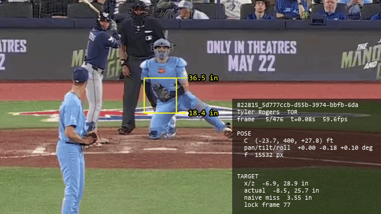
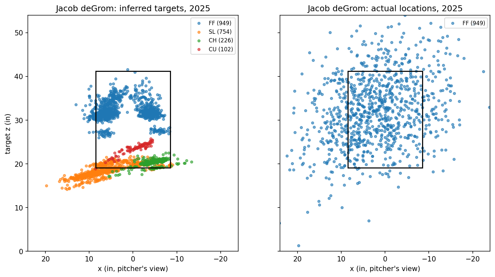
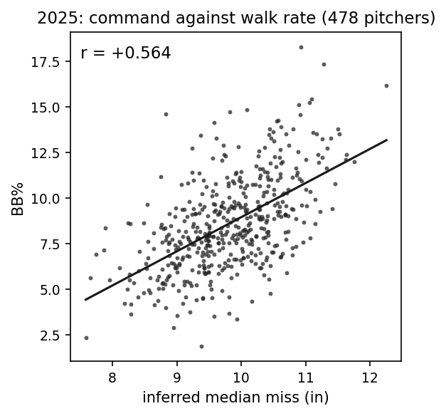

<div align="center">


[](https://huggingface.co/datasets/tomdoyo/open-command)
[](https://creativecommons.org/licenses/by-nc-sa/4.0/)
[](https://github.com/tomdoyo/open-command)

[How it Works](#how-it-works) · [Data](#data) · [Topics](#topics) · [Citation](#license--citation)

</div>

> [!IMPORTANT]  
> Git history has been rewritten due to restructuring for large file support. If you have an existing clone or fork, delete it and re-clone.

# Let's Measure Command

OpenCommand scores **command** using the pitch location's distance from target.

This repo contains 2025/2026 computer vision object detections and the full inference pipeline for producing **target estimates** and resulting **command scores**.

<p align="center">
  
</p>
<p align="center"><sub>Tyler Rogers dots a backdoor sinker (TB @ TOR, 2026/05/13). <b>Yellow box:</b> broadcast strikezone detection. <b>Thin white circle:</b> catcher glove detection. <b>Thick white circle:</b> glove detection projected onto strikezone plane.</sub></p>

## Updates

#### 2026-08-21: Version 1.1.0
- Targets are now chosen at the *highest glove position in the pre-pitch window<sup>1</sup>, **discounted by how early it is**.*

<sub><sup>1</sup> Median of ±0.05s around this used to be targets

## How it Works

### Summary
- Estimate camera position with broadcast strikezone & ball detection
- Estimate camera zoom/pan/tilt with broadcast strikezone & camera position
- Estimate glove location with camera position/zoom/pan/tilt/roll & glove detection
- Estimate target with glove location
- Estimate command with target & actual location

### Install

```
pip install -r requirements.txt          
# or:  conda env create -f environment.yml
```

### Pipeline

Every script in `src/` takes upstream CSVs and writes **one** output.  
And they're standalone: `python src/<script>.py [year=2026] ...`  
(This means you can work on a single stage by regenerating just that stage's file!)  

```
raw/gloveball_tracks  raw/strikezone_tracking
     │       │              │
     │       └──────┬───────┘
     │              ▼                            
     │  1. solve_camera_pose.py ──► camera_poses.csv.gz
     │              │                            
     └──────┬───────┘                            
            ▼                                    
  2. solve_glove_locations.py ──► glove_locations/ 
            │                                    
            ▼                                    
  3. target_inference.py ──► targets.csv.gz
            │                                    
            ▼                                   
  4. opencommand.py  ──► command_scores.csv
                        (+ artifacts/validations_<year>.txt)

```

| Step | Script | Reads | Writes |
|---|---|---|---|
| 1 | `solve_camera_pose.py` | gloveball_tracks, strikezone_tracking, pbp_info | `camera_poses.csv.gz` |
| 2 | `solve_glove_locations.py` | gloveball_tracks, camera_poses | `glove_locations/<game_pk>.csv.gz` |
| 3 | `target_inference.py` | glove_locations, pbp_info | `targets.csv.gz` |
| 4 | `opencommand.py` | targets, pbp_info, camera_poses, fg_pitching | `command_scores.csv` + `artifacts/validations_<year>.txt` |
| — | `poselib.py` | (library, not a stage) | imported by steps 1 and 2 |

> Step 1 is particularly heavy (hours); other steps take minutes.


### In detail

*See [here](https://x.com/tomdoyo/status/2087272169852088752) for visuals!*

#### **1. Solving camera pose** (every pitch)
- The CF camera is a fixed mount per game that pans/tilts/zooms per pitch.
- Estimate *where* the camera is:
  - Statcast's 9-parameter equation `(xyz_0, xyz_velo, xyz_acc)` gives us ball position in time (through pitch trajectory).
  - Broadcasts draw strikezone as `(17in width, sz_top/sz_bot)` at the front of the plate (middle for 2026).
  - These give us **12+** datapoints per pitch (8+ ball pixels, 4 box corners) to fit<sup>1</sup> **7** parameters: `(Cx, Cy=400`<sup>2</sup>`, Cz, pan, tilt, roll, f, t0)`.
  - Just keep the game median `Cx`/`Cz`<sup>3</sup>.
- Fit (pan, tilt, roll, f) separately with fixed `(Cx, Cy, Cz)`.
  - Use the drawn strikezone at a snapshot pre-pitch<sup>4</sup>.
  - Don't use ball positions because camera often moves mid-ball flight.

<sub><sup>1</sup> Levenberg-Marquardt on the pixel reprojection error, with a soft_l1 loss.<br>
<sup>2</sup> Camera depth (`Cy`) is degenerate against focal length (`f`): moving camera back and zooming in produce nearly the same pixels. Not a big deal down the line so `Cy` is fixed at 400.<br>
<sup>3</sup> Others are nuisance parameters.<br>
<sup>4</sup> Snapshot is taken when glove is at the highest point in the [release-2.0s, release-0.3s] window.</sub>

#### **2. Solving glove location** (every frame)
- `glove_px/pz` is a 2D projection of glove onto the camera.
- Use camera pose `(Cx, Cy, Cz, pan, tilt, roll, f)` to unproject detected `glove_px/pz` into *global* `glove_xyz`<sup>1</sup>.

<sub><sup>1</sup> Like `Cy`, glove depth (`glove_y`) is really hard to estimate. So we assume `glove_y` to be -1.75ft (median catch depth).<br>

#### **3. Inferring target with glove locations**
- Take the highest `glove_xz` in the [release-2.0s, release-0.3s] window, discounted by how early it is<sup>1</sup>. This is the **naive** target.
- Many pitchers like to "start the pitch from the glove and let the ball break away from it". To account for this, add `pitcher × pitch type × season` offset. This is the **inferred target**.
  - This assumes every pitcher is **perfectly calibrated** on a pitch type level.
- Use plausibility filter<sup>2</sup> to filter out extreme targets.

<sub><sup>1</sup> This is mainly to avoid decoy targets, usually when the runner is on second base.<br>
<sup>2</sup> (`|x|` over 20in, `z` outside the pitch-type floor/cap)</sub>

#### **4. Scoring command**
- `miss` = distance from the actual location to target.
- For leaderboards, **median** miss is used, after plausible target filter.

## Data

### Download

The data lives on Hugging Face.

```
pip install huggingface_hub
hf download tomdoyo/open-command --repo-type dataset --local-dir data
```

That puts the tree where every script expects it. To take one file instead of all of them:

```
hf download tomdoyo/open-command 2026/command_scores.csv --repo-type dataset --local-dir data
```

### Layout

Each season lives under `data/<year>/`. 

**Keys:** `(game_pk, play_id)` identify a pitch.

Raw detections (in `data/<year>/raw/`) are produced using YOLO11 glove/ball/strikezone detector models, with postprocessing based on detection confidence.

| File (per season) | One row per | Contents |
|---|---|---|
| `pbp_info.csv.gz` | pitch | Statcast 9-parameter trajectory, `sz_top`/`sz_bot`, plate location, pitcher, pitch type, and the game_date/type/venue |
| `raw/gloveball_tracks/<game_pk>.csv.gz` | frame | glove + ball detections (pixels on screen) |
| `raw/strikezone_tracking.csv.gz` | clip | broadcast strikezone detections (pixels on screen) |
| `camera_poses.csv.gz` | clip | camera pose (+ vote diagnostics & reprojection accuracies) |
| `glove_locations/<game_pk>.csv.gz` | detection | solved glove location (real-world) |
| `targets.csv.gz` | clip | naive/inferred targets |
| `command_scores.csv` | pitcher, pitch type | n, naive and inferred median miss |

### Coverage

OpenCommand tracks nearly all the pitches that it *can*, with most clips lost being due to *no strikezone detected*<sup>1</sup> and *late center field camera cut*<sup>2</sup>.

**For 2025:** 89.63 / 93.17% possible

| Funnel loss | Clips Lost (%) | Remaining | Coverage |
|---|---:|---:|---:|
| All pitches | — | 724,005 | 100.00% |
| Clip never published | 763 (-0.11%) | 723,242 | 99.89% |
| No strikezone detected | 30,404 (-4.20%) | 692,838 | 95.70% |
| No ball release detected | 11,719 (-1.62%) | 681,119 | 94.08% |
| Late center field camera cut | 18,267 (-2.52%) | 662,852 | 91.55% |
| Low detection quality | 10,880 (-1.50%) | 651,972 | 90.05% |
| Implausible target | 3,056 (-0.42%) | **648,916** | **89.63%** |

<sub><sup>1</sup> Sometimes broadcasts don't draw a strikezone box on the screen<br>
<sup>2</sup> Sometimes camera cuts to CF-cam (i.e. pitcher-batter view) too late</sub>

## Topics

### Target maps

A nice feature of this is that you can tell where the pitcher was *trying* to throw, which is really hard just looking at the final location.

<p align="center">
  
</p>

### Command distribution

Couple notes:
- Inferring targets (pitcher × pitch-type offset) shaves off about **1 inch** off of naive miss. 
- MLB pitchers miss by 9-11 inches
- Pitchers command fastballs ~1 inch better
- The miss distribution has some right skew

**2025, naive median miss** — min. 50 pitches

| Pitch type | Pitchers | Min | p10 | p25 | Median | p75 | p90 | Max |
|---|---:|---:|---:|---:|---:|---:|---:|---:|
| All pitches | 716 | 8.39 | 9.85 | 10.42 | 11.06 | 11.88 | 12.75 | 15.94 |
| Four-seam (FF) | 581 | 7.33 | 8.38 | 9.22 | 10.07 | 10.88 | 11.81 | 14.22 |
| Sinker (SI) | 380 | 6.10 | 8.50 | 9.18 | 9.92 | 10.95 | 12.14 | 18.34 |
| Cutter (FC) | 215 | 6.84 | 8.42 | 9.04 | 9.82 | 10.72 | 11.71 | 15.90 |
| Slider (SL) | 393 | 7.31 | 9.68 | 10.54 | 11.53 | 13.11 | 14.32 | 20.56 |
| Sweeper (ST) | 230 | 8.66 | 10.01 | 10.92 | 11.95 | 13.38 | 14.51 | 19.65 |
| Curveball (CU+KC) | 248 | 8.32 | 10.82 | 11.79 | 13.07 | 14.60 | 16.10 | 21.30 |
| Changeup (CH) | 301 | 8.26 | 10.48 | 11.59 | 12.78 | 14.42 | 16.48 | 28.97 |
| Splitter (FS) | 95 | 7.59 | 10.65 | 12.11 | 13.70 | 15.73 | 17.28 | 22.26 |

**2025, inferred median miss** — naive + pitcher × pitch-type offset

| Pitch type | Pitchers | Min | p10 | p25 | Median | p75 | p90 | Max |
|---|---:|---:|---:|---:|---:|---:|---:|---:|
| All pitches | 716 | 7.37 | 8.91 | 9.43 | 9.97 | 10.56 | 11.13 | 14.54 |
| Four-seam (FF) | 581 | 6.77 | 8.17 | 8.70 | 9.39 | 10.13 | 10.87 | 12.76 |
| Sinker (SI) | 380 | 6.09 | 7.99 | 8.49 | 9.11 | 9.88 | 10.65 | 13.40 |
| Cutter (FC) | 215 | 6.87 | 8.09 | 8.64 | 9.37 | 10.12 | 10.77 | 13.28 |
| Slider (SL) | 393 | 6.97 | 8.97 | 9.68 | 10.39 | 11.25 | 12.05 | 14.60 |
| Sweeper (ST) | 230 | 8.11 | 9.39 | 9.88 | 10.66 | 11.51 | 12.46 | 15.01 |
| Curveball (CU+KC) | 248 | 8.37 | 9.84 | 10.62 | 11.40 | 12.37 | 13.37 | 17.17 |
| Changeup (CH) | 301 | 7.20 | 9.07 | 9.78 | 10.56 | 11.32 | 12.04 | 14.85 |
| Splitter (FS) | 95 | 7.41 | 9.30 | 9.96 | 10.99 | 12.06 | 13.12 | 15.56 |

### Some correlations

**2025** — 339 pitchers, min. 50 innings

| | Naive | Inferred |
|---|---:|---:|
| BB% | +0.456 [+0.366, +0.541] | +0.547 [+0.465, +0.626] |
| Stuff+ | +0.198 [+0.096, +0.297] | +0.251 [+0.147, +0.345] |
| xERA | -0.071 [-0.180, +0.034] | -0.069 [-0.175, +0.039] |
| xERA \| Stuff+ | +0.085 [-0.022, +0.190] | +0.137 [+0.029, +0.243] |

In particular, we can see a strong correlation between command and walk rates.
<p align="center">
  
</p>

#### **Why (~~mean~~) median miss?** 
- Median is more robust to extreme values (e.g. due to bad inferred targets/glove detections/etc.)
- Median (50th percentile) better answers "what's pitcher x's *typical* miss?". A pitcher can't miss by less than 0 in, but can spike one and get a 100 inch miss, which takes 100 pitches with 1 inch above mean miss to make up for it. So coloquially, median makes more sense as an "average".

#### **How accurate is OpenCommand at measuring command?**
- This is really hard to tell because there's no *ground truth* (unless we ask "hey where did you aim?" every pitch).
- True median miss for **fastballs** is probably [7 to 10 inches](https://x.com/tomdoyo/status/2082066794404294671?s=20).
- Glove detections get post-hoc adjustments based on detection accuracies. This adjustment makes miss distances unbiased, but doesn't remove the pitch-level variance. 
- Inferred miss assumes every pitcher perfectly calibrates his pitches, but most pitchers are probably an inch or two off. At the same time, most pitchers fine tune their targets (beyond the catcher's glove) every pitch, depending on the situation. Perhaps these two cancel off on a season-level. 
- So, on a season-level, OpenCommand has a good chance of being accurate within <1 inch. On a pitch-level, certainly not. 

#### **Which pitchers are represented well/worse?**
- Some pitchers see-glove-hit-glove (especially ones that throw down the middle). These pitchers have the best OpenCommand representations.
- Some pitchers do the **opposite** of micro-adjustment. They make their catchers adjust the glove depending on their miss patterns that day so that their end locations stay the same.
- Some pitchers **don't look at the glove at all** (e.g. Misiorowski). These pitchers are heavily misrepresented. 

## License & citation

Everything in this repository, data and code, is released under [CC BY-NC-SA 4.0](https://creativecommons.org/licenses/by-nc-sa/4.0/): use it, build on it, publish with it, with **attribution** (cite OpenCommand; see [CITATION.cff](CITATION.cff)) and **not commercially**. 

Data derived from MLB broadcast video and Statcast public feeds. MLB and Statcast are trademarks of MLB Advanced Media, L.P.; this project is not affiliated with MLB.
